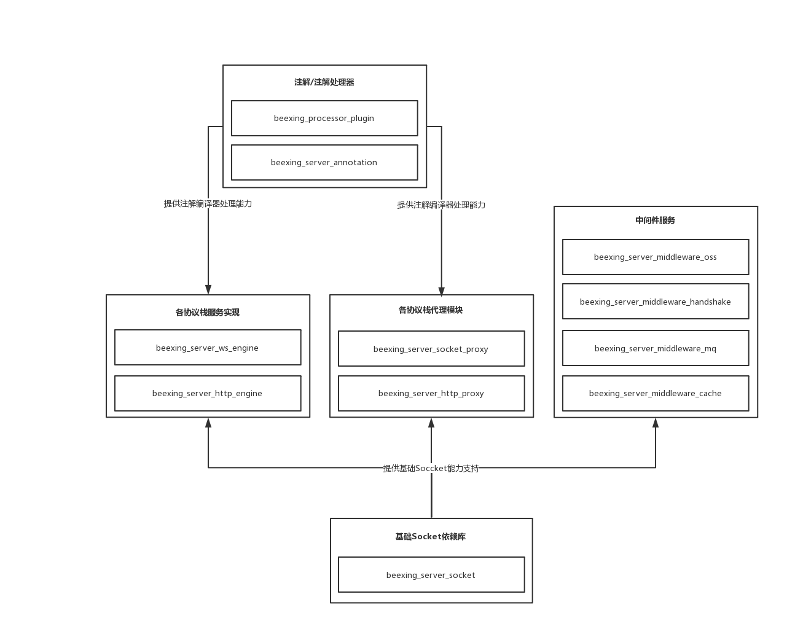

# BeexingWeb
## 简介

**BeexingWeb 基于Android系统的Web服务及扩展，目前支持的协议和中间件如下：**

* 协议簇
  * Http1
  * Http2
  * Ws/Wss
* 代理
  * Http1/Http2 Proxy
  * Socket Proxy
* 中间件
  * oss
  * message queue
  * handshake
  * cache

## 组件结构图

